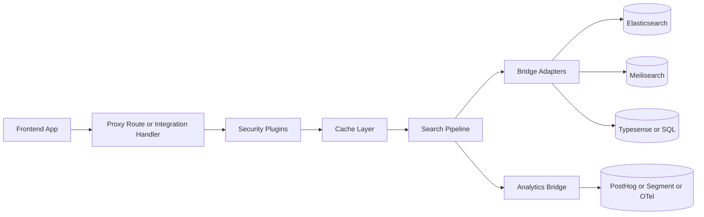

# alternate-search

`alternate-search` is a typed search framework with pluggable adapters, middleware, and plugins.

It is built around a stable adapter bridge so teams can swap engines (Meilisearch, Typesense, Elasticsearch/OpenSearch, SQL/pgvector, custom backends) without rewriting application-level query logic.

## Quick Start

```ts
import { createSearch, defineIndex, textField, keywordField, meilisearchAdapter } from "alternate-search";

const search = createSearch({
  adapter: meilisearchAdapter({
    baseUrl: process.env.MEILI_URL!,
    apiKey: process.env.MEILI_API_KEY,
  }),
  indexes: {
    products: defineIndex({
      fieldMap: {
        title: textField({ searchable: true }),
        description: textField({ searchable: true }),
        category: keywordField({ filterable: true, facetable: true }),
      },
      primaryKey: "id",
    }),
  },
});

await search.setup();

const result = await search.query("products", {
  q: "wireless keyboard",
  page: 1,
  pageSize: 20,
  filters: [{ field: "category", operator: "=", value: "accessories" }],
  sort: [{ field: "_score", order: "desc" }],
  facets: ["category"],
});
```

## Architecture



## Bridge Interface

The adapter bridge is the core compatibility contract.

```ts
export type SearchAdapter = {
  setup(indexes: Record<string, IndexSchema>): Promise<void>;
  index(indexName: string, docs: SearchDocument[], options?: { upsert?: boolean; batchSize?: number }): Promise<void>;
  query(indexName: string, query: SearchQuery): Promise<SearchResult>;
  delete(indexName: string, id: string): Promise<void>;
  deleteWhere?: (indexName: string, filters: FilterCondition[]) => Promise<number>;
  stats?: (indexName: string) => Promise<{ count: number; size?: number }>;
};
```

### Required Methods

1. `setup(indexes)`
- Must be idempotent.
- Creates or validates physical indexes/collections/tables.
- Should not fail when called repeatedly in deploy/startup flows.

2. `index(indexName, docs, options)`
- Writes documents for one logical index.
- Supports batch writes and optional upsert behavior.
- Must preserve document `id` semantics consistently.

3. `query(indexName, query)`
- Executes a typed `SearchQuery` and returns normalized `SearchResult`.
- Must return `items`, `total`, `page`, and `pageSize`.
- Should populate `facets`, `highlights`, `nextCursor`, and `took` when available.

4. `delete(indexName, id)`
- Deletes exactly one document by `id`.

### Optional Methods

1. `deleteWhere(indexName, filters)`
- Bulk delete by normalized filter conditions.
- Returns number of removed documents.

2. `stats(indexName)`
- Returns at least `{ count }`.
- `size` is optional and backend-specific.

## Query Semantics Adapters Must Respect

1. Pagination
- Accept `page` + `pageSize` (and alias `limit`).
- If cursor pagination is supported, honor `cursor` and return `nextCursor`.

2. Filters
- `filters` can arrive as either:
  - `FilterCondition[]` (normalized operators like `=`, `IN`, `>=`)
  - Record map `{ field: value }` for simple equality
- Adapters should normalize internally before backend execution.

3. Sorting
- `sort` can be one criterion or an ordered list.
- Unknown sort fields should be ignored safely or rejected with typed adapter errors.

4. Facets
- `facets` can be `string[]` or `FacetRequest[]`.
- When possible, return per-field counts and optional numeric stats (`min`, `max`, `avg`, `sum`).

5. Highlights
- Respect `highlight.fields` and optional tags (`preTag`, `postTag`).
- Return `highlights` in a stable map format when backend supports snippet extraction.

## Error and Timeout Behavior

1. Use adapter-specific errors for backend failures and timeouts.
2. Include safe diagnostic context (index name, operation, status code) without leaking secrets.
3. Fail fast on malformed query payloads; do not silently return empty data for invalid input.
4. Surface transient backend failures clearly so multi-backend routing/fallback can react.

## Resilience (Circuit Breakers + Fallback Chains)

The multi-backend adapter supports per-backend circuit breakers and fallback chains.

```ts
import { multiBackendAdapter } from "alternate-search";

const adapter = multiBackendAdapter({
  backends: [
    { id: "elasticsearch", adapter: esAdapter, priority: 10, optional: false },
    { id: "sqlite", adapter: sqliteAdapter, priority: 20, optional: true },
  ],
  circuitBreaker: {
    failureThreshold: 3,
    cooldownMs: 30_000,
    probeRequests: 1,
    fallbackResult: "cached", // or "empty"
  },
  fallbackChains: {
    elasticsearch: ["sqlite"],
  },
});
```

Behavior summary:

1. A backend that fails repeatedly is opened for cooldown and short-circuited.
2. Open circuits can immediately return empty/cached results.
3. Fallback chains attempt Plan B backends automatically.

## Advanced Security

### JWT verification helper in security middleware

```ts
import { security, createJoseJwtVerifier } from "alternate-search";

const secure = security({
  jwt: {
    required: true,
    verify: createJoseJwtVerifier({
      secret: process.env.JWT_SECRET!,
      issuer: "search-proxy",
      audience: "search-clients",
    }),
  },
});
```

### Field-level masking before response leaves proxy

```ts
import { fieldMasking } from "alternate-search";

const mask = fieldMasking({
  hiddenByRole: {
    guest: ["costPrice", "internalNotes"],
    analyst: {
      products: ["internalNotes"],
    },
  },
});
```

## Progressive Streaming for Federated Search

Core API:

```ts
for await (const chunk of search.queryManyStream([
  { indexName: "products", query: { q: "running" } },
  { indexName: "docs", query: { q: "running" } },
])) {
  // emit chunk via SSE or NDJSON
}
```

Nuxt integration includes a streaming handler (`defineSearchStreamEventHandler`) that supports `transport=ndjson|sse`.

## Purge API for Immediate Cache Invalidation

Use purge when your source database changes (for example, product price/title updates) and cached search responses must be invalidated immediately.

```ts
import { toNodeHandler } from "alternate-search/integrations/node";
import { createRedisCacheStorage, purgeCacheStorage } from "alternate-search";

const storage = createRedisCacheStorage(redisClient, { prefix: "search:cache:" });

app.use("/api/search", toNodeHandler(search, {
  purge: ({ indexName, request }) =>
   purgeCacheStorage(storage, {
    scope: request.scope ?? "index",
    indexName,
    tenantId: request.tenantId,
    query: request.query,
    key: request.key,
   }),
}));
```

Example HTTP calls:

1. Purge all cached entries for one index:
  `POST /api/search/products?_action=purge` with body `{ "scope": "index" }`
2. Purge one tenant slice:
  `POST /api/search/products?_action=purge` with body `{ "scope": "tenant", "tenantId": "t1" }`
3. Purge one query cache key:
  `POST /api/search/products?_action=purge` with body `{ "scope": "query", "query": { "q": "shoe", "tenantId": "t1" } }`
4. Purge all cache entries:
  `POST /api/search/products?_action=purge` with body `{ "scope": "all" }`

## Cookbook

### Pattern: E-commerce with Meilisearch + PostHog

1. Use `meilisearchAdapter` for product catalog search.
2. Add `security` with JWT for authenticated shopper context.
3. Add `fieldMasking` to hide margin/internal fields for non-admin roles.
4. Configure analytics bridge with PostHog provider for search/click/conversion events.
5. Enable caching SWR for high-frequency category and autocomplete queries.

### Pattern: High-Availability Primary + Fallback

1. Configure primary backend (Elasticsearch) and fallback backend (SQLite or Meilisearch).
2. Enable circuit breaker with cooldown.
3. Set `fallbackChains` for automatic backend failover.
4. Turn on debug mode in non-production to inspect backend timings/errors.

## Search CLI and Toolkit (1.0 Scope)

For 1.0, the runtime API surface is stable and CLI/tooling is documented as a first-party workflow track:

1. Local dev proxy command flow (mock bridge for frontend-only work).
2. Migration utility flow for backend-to-backend data movement.

See `ROADMAP.md` for execution sequencing and rollout checkpoints.

## Minimal Custom Adapter Example (Vector DB)

```ts
import type { SearchAdapter, SearchDocument, SearchQuery, SearchResult } from "alternate-search";

export function vectorBridgeAdapter(client: {
  createCollection: (name: string) => Promise<void>;
  upsertMany: (collection: string, docs: SearchDocument[]) => Promise<void>;
  search: (collection: string, payload: Record<string, unknown>) => Promise<{
    items: SearchDocument[];
    total: number;
    took?: number;
  }>;
  remove: (collection: string, id: string) => Promise<void>;
}): SearchAdapter {
  return {
    async setup(indexes) {
      await Promise.all(Object.keys(indexes).map((name) => client.createCollection(name)));
    },

    async index(indexName, docs) {
      await client.upsertMany(indexName, docs);
    },

    async query(indexName, query): Promise<SearchResult> {
      const page = Math.max(1, query.page ?? 1);
      const pageSize = Math.max(1, query.pageSize ?? query.limit ?? 20);

      const response = await client.search(indexName, {
        text: query.q ?? query.term,
        filters: query.filters,
        vector: query.vector,
        sort: query.sort,
        facets: query.facets,
        page,
        pageSize,
      });

      return {
        items: response.items,
        total: response.total,
        page,
        pageSize,
        took: response.took,
      };
    },

    async delete(indexName, id) {
      await client.remove(indexName, id);
    },
  };
}
```

## Minimal Custom Adapter Example (Legacy SQL)

```ts
import type { SearchAdapter, SearchDocument, SearchQuery } from "alternate-search";

export function legacySqlAdapter(db: {
  exec: (sql: string, params?: unknown[]) => Promise<{ rows?: unknown[]; rowCount?: number }>;
}): SearchAdapter {
  return {
    async setup() {
      // Existing schema managed outside alternate-search.
    },

    async index(indexName, docs) {
      for (const doc of docs) {
        await db.exec(`INSERT INTO ${indexName} (id, payload) VALUES ($1, $2) ON CONFLICT (id) DO UPDATE SET payload = EXCLUDED.payload`, [
          doc.id,
          JSON.stringify(doc),
        ]);
      }
    },

    async query(indexName, query) {
      const page = Math.max(1, query.page ?? 1);
      const pageSize = Math.max(1, query.pageSize ?? query.limit ?? 20);
      const offset = (page - 1) * pageSize;

      const q = String(query.q ?? query.term ?? "").trim();
      const result = await db.exec(
        `SELECT payload FROM ${indexName} WHERE ($1 = '' OR payload::text ILIKE '%' || $1 || '%') ORDER BY id LIMIT $2 OFFSET $3`,
        [q, pageSize, offset],
      );

      const items = (result.rows ?? []).map((row) => {
        const payload = (row as { payload: string }).payload;
        return JSON.parse(payload) as SearchDocument;
      });

      return {
        items,
        total: result.rowCount ?? items.length,
        page,
        pageSize,
      };
    },

    async delete(indexName, id) {
      await db.exec(`DELETE FROM ${indexName} WHERE id = $1`, [id]);
    },
  };
}
```

## Release Documents

For release and contributor context, see:

- `CHANGELOG.md`
- `ROADMAP.md`
- `WHATS_NEW.md`
- `STABILITY_CONTRACT.md`